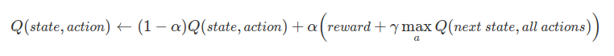

[](https://asciinema.org/a/426538)

## **Preface**

### **What I learn in this project**

1. Learn about the basics of reinforcement learning and how to create pathfinding agent using Q-Learning
2. Understand the concept of agent, q-learning, q-table, q-value, and environment
3. Code the environment of pathfinding agent from taxi-v3 that we modified
4. Think of one use case of this project to be an Automated Delivery agent.

### **What is Q-Learning, Q-table, Q-Value?**

Q-learning is one of the basic algorithms in the reinforcement learning category. This algorithm works by creating a table called q-table that stores q-values. This algorithm will find the best step to maximize rewards.

Q-table is a matrix that shaped "all possible states in the environment" x "all possible moves". Q-table try to maps the best action given a state in the environment. We then can determine what actions should be taken by the agent by choosing the biggest q-value in the table. The Q-table looks like this.


For example, if we are in a state represented by the number 10, we will look at row 10, and find which columns have the biggest q-value. And in this case, maybe it's the second row, what moves the second row is? Maybe it's turning right. And then we choose to turn right.

Now you might be thinking, how to maps those q-values? The mapping process is done in the training process of the agent. We have to remember that this algorithm is in the reinforcement learning area. The agent will learn a pattern of how to take an action given the current state by experimenting or interacting with the environment and responds with the rewards that the environment gives (see how reinforcement learning works). Or in other words, it learns by trial and error.

In the training process, the agent will do either exploration or exploitation in every step.

1. Exploitation means that the agent will take the best step or action from information that it knows.
2. Exploration means that the agent will take a random step. This will allows the agent to discover new or possibly the better step than the one it already knows.

In the training, the agent will always update its q-values in the q-tables for every step it takes based on the reward that it receives from its environments. It will calculate its new q-values by using this formula.



In those formulas, you can find some unknown mathematic symbols. Those are called Hyperparameters. Here is what it means.

- Epsilon (ϵ), represents how much "exploration" that you want your agent to do. In other words, exploration rates.
- Learning rate or alpha (α), how much new value you want to include compared to the old value.
- Gamma (γ), to balance the rewards that will be obtained in the short term and the long term.

We can improve the training and agent performance by tweaking those 3 values.

<!--more-->

## **How I Make this Project**

***

### **Creating The Environment**

First, before we creating and training our agents, we need to create our environment. The environment I want to create is the environment to simulate a delivery robot. I create this by modifying the already existent environment "Taxi-V3" from OpenAI Gym that you can find [here](https://github.com/openai/gym/blob/master/gym/envs/toy_text/taxi.py).

The thing that I changed is not too many, but it takes me a pretty good amount of mind and time. The one that I change is the theme of the environment, from taxi to delivery robot, and the map size (I try to change and experiment, but in the end, I only could change it to $10\times10$ and $8\times8$ in size). Here is the environment class:

Importing dependency

```python
import os, sys, time, random
import numpy as np
from IPython.display import clear_output
from contextlib import closing
from io import StringIO

from gym import utils
from gym.envs.toy_text import discrete
from time import sleep
```

```python
MAP = [
    "+-------------------+",
    "|R| | : | : | : : :G|",
    "| | | | : : | : : : |",
    "| | : | : : | : | : |",
    "| | : | : : | : | : |",
    "| | : | : : | : | : |",
    "| | : | : |B| : | : |",
    "| : : | : : : : | : |",
    "| | : | : : : : | : |",
    "| | : | : : : : | : |",
    "|Y| : : : : | : : : |",
    "+-------------------+",
]

class DeliveryRobotEnv(discrete.DiscreteEnv):
    
    metadata = {'render.modes': ['human', 'ansi']}

    def __init__(self):
        self.desc = np.asarray(MAP, dtype='c')

        self.locs = locs = [(0, 0), (0, 9), (9, 0), (5, 5)]

        num_states = 2000  # 10 * 10 * 5 * 4
        num_rows = 10
        num_columns = 10
        max_row = num_rows - 1
        max_col = num_columns - 1
        initial_state_distrib = np.zeros(num_states)
        num_actions = 6
        P = {state: {action: [] for action in range(num_actions)} for state in range(num_states)}

        for row in range(num_rows):
            for col in range(num_columns):
                for goods_idx in range(len(locs) + 1):
                    for dest_idx in range(len(locs)):
                        state = self.encode(row, col, goods_idx, dest_idx)
                        if goods_idx < 4 and goods_idx != dest_idx:
                            initial_state_distrib[state] += 1
                        for action in range(num_actions):
                            new_row, new_col, new_goods_idx = row, col, goods_idx
                            reward = -1 
                            done = False
                            robot_loc = (row, col)

                            if action == 0:
                                new_row = min(row + 1, max_row)
                            elif action == 1:
                                new_row = max(row - 1, 0)
                            if action == 2 and self.desc[1 + row, 2 * col + 2] == b":":
                                new_col = min(col + 1, max_col)
                            elif action == 3 and self.desc[1 + row, 2 * col] == b":":
                                new_col = max(col - 1, 0)
                            elif action == 4:  # pickup
                                if goods_idx < 4 and robot_loc == locs[goods_idx]:
                                    new_goods_idx = 4
                                else:  # goods not at location
                                    reward = -10
                            elif action == 5:  # dropoff
                                if (robot_loc == locs[dest_idx]) and goods_idx == 4:
                                    new_goods_idx = dest_idx
                                    done = True
                                    reward = 30
                                elif (robot_loc in locs) and goods_idx == 4:
                                    new_goods_idx = locs.index(robot_loc)
                                else:  # dropoff at wrong location
                                    reward = -10
                            new_state = self.encode(new_row, new_col, new_goods_idx, dest_idx)
                            P[state][action].append((1.0, new_state, reward, done))

        initial_state_distrib /= initial_state_distrib.sum()
        discrete.DiscreteEnv.__init__(self, num_states, num_actions, P, initial_state_distrib)

    def encode(self, robot_row, robot_col, goods_loc, dest_idx):
        i = robot_row
        i *= 10
        i += robot_col
        i *= 5
        i += goods_loc
        i *= 4
        i += dest_idx
        return i

    def decode(self, i):
        out = []
        out.append(i % 4)
        i = i // 4
        out.append(i % 5)
        i = i // 5
        out.append(i % 10)
        i = i // 10
        out.append(i)
        assert 0 <= i < 10
        return reversed(out)

    def step(self, a):
        assert 0 <= a < 2000
        return super().step(a)

    def render(self, mode='human'):
        outfile = StringIO() if mode == 'ansi' else sys.stdout

        out = self.desc.copy().tolist()
        out = [[c.decode('utf-8') for c in line] for line in out]
        robot_row, robot_col, goods_idx, dest_idx = self.decode(self.s)

        for a in out:
            for b in range(len(a)):
                if a[b] == '|' or a[b] == '+' or a[b] == '-':
                    a[b] = utils.colorize(a[b], 'cyan')

        def ul(x):
            return "_" if x == " " else x

        if goods_idx < 4:
            out[1 + robot_row][2 * robot_col + 1] = utils.colorize(
                out[1 + robot_row][2 * robot_col + 1], 'yellow', highlight=True)
            pi, pj = self.locs[goods_idx]
            out[1 + pi][2 * pj + 1] = utils.colorize(out[1 + pi][2 * pj + 1], 'blue', bold=True)
        else:  # passenger in taxi
            out[1 + robot_row][2 * robot_col + 1] = utils.colorize(
                ul(out[1 + robot_row][2 * robot_col + 1]), 'green', highlight=True)

        di, dj = self.locs[dest_idx]
        out[1 + di][2 * dj + 1] = utils.colorize(out[1 + di][2 * dj + 1], 'magenta')
        outfile.write("\n".join(["".join(row) for row in out]) + "\n")
        if self.lastaction is not None:
            outfile.write("  ({})\n".format(
                ["South", "North", "East", "West", "Pickup", "Drop off"][self.lastaction])
            )
            
        else:
            outfile.write("\n")

        if mode != 'human':
            with closing(outfile):
                return outfile.getvalue()

```

And here is how it works:

**Description:**

> There are four designated locations in the grid world indicated by R, G, Y, and B. When the episode starts, the robot starts off at a random square and the goods are at a random location. The robot drives to the goods' location, picks it up, carries it to the destination (another one of the four specified locations), and then drops off the goods. Once the good is dropped off, the episode ends.

**Observations:**

> There are 2000 discrete states.

**Passenger locations:**

> - 0: R(ed)
> - 1: G(reen)
> - 2: Y(ellow)
> - 3: B(lue)
> - 4: in taxi

**Destinations:**

> - 0: R(ed)
> - 1: G(reen)
> - 2: Y(ellow)
> - 3: B(lue)

**Actions:**
There are 6 discrete deterministic actions:

> - 0: move south
> - 1: move north
> - 2: move east
> - 3: move west
> - 4: pickup
> - 5: drop off

**Rewards:**
> There is a default per-step reward of -1,
except for delivering the goods, which is +20,
or executing "pickup" and "drop-off" actions illegally, which is -10.

**Rendering:**

> - blue: goods
> - magenta: destination
> - yellow: empty robot
> - green: robot carrying goods
> - other letters (R, G, Y and B): locations for robot and destinations

**state space is represented by:**

>(robot_row, robot_col, goods_loc, destination)

Now you may be wondering, what is encode and decode functions are used for in that class. Just like the name, it will encode or decode the value from and to (robot_row, robot_col, goods_loc, destination) to exactly one discrete value. Those exactly one discrete values will be useful to map the environment state to one of which row in our table.

Those encode and decode method is the reason why the Taxi-V3 environment is hard to modify. Cause you need to find the method/algorithm to encode and decode.

The new class, as you can see has 2000 possible states. It is because there are $10 \times 10$ sized maps (100 possible maps position), 5 possible goods locations (R, G, B, Y, and carried by the robot), and 4 possible destinations. So the final count is $100 \times 5 \times 4$ which is 2000.

Now we can create the object of our environment

```python
env = DeliveryRobotEnv()
print("Observation space : ", env.observation_space)
print("Action space : ", env.action_space)
```

Then we can tested it

```python

num_episodes = 3
max_step = 50

for episode in range(num_episodes):
    obs = env.reset()
    score = 0
    done = False
    step = 0

    while not done and step != max_step:
        
        action = env.action_space.sample()
        clear_output(wait=True)
        
        print(f"Episode : {episode+1}")
        print(f"Observation space / State : {obs}")
        print(f"Number of Steps : {step}")
        
        env.render()
        obs, reward, done, info = env.step(action)
        sleep(0.15)
        score += reward
        step += 1
              
    print(f"\nResult\nEpisode : {episode+1}\nScore : {score}")
    status = "Success" if done else "Not Yet"
    print(f"Status : {status}")
    sleep(2)

env.close()

```

### **Creating Agent**

In this case, we create our agent by creating the q-table. We create it using NumPy arrays.

```python
q_table = np.zeros([env.observation_space.n, env.action_space.n])
```

### **Training agent**

We first need to specify the hyperparameters

```python
alpha = 0.1
gamma = 0.6
epsilon = 0.1
```

then we can train it using this code. We put how many times we want our agent to train. The bigger the number, the longer it takes for our agent to train. Next is to run the code and train.

```python
total_episodes = 500000

for i in range(1, total_episodes+1):
    state = env.reset()
    done = False

    while not done:
        if random.uniform(0, 1) < epsilon:  
            action = env.action_space.sample()  # exploration
        else:
            action = np.argmax(q_table[state])  # exploitation

        next_state, reward, done, info = env.step(action)
        old_value = q_table[state, action]
        next_max = np.max(q_table[next_state])

        new_value = (1 - alpha) * old_value + alpha * (reward + gamma * next_max)  # Count new value
        q_table[state, action] = new_value  # Insert new value
        state = next_state

    if i % 100 == 0:
        clear_output(wait=True)
        print(f"Training.{'.' * (i%6)}")
        print(f"Episode: {i}/{total_episodes}")

print("\nTraining finished.\n")
```

After the train, we can save the q-table that contains the value from our training so that we don't have to retrain every time we want to run the program. We can do that by using the method/API from NumPy.

```python
# Saving
np.save("ModelAgent.npy", q_table)

# Loading
q_table = np.load("ModelAgent.npy")
```

### **Testing The agent**

We can evaluate the agent performance using this code

```python
results = []
total_epochs, total_penalties, total_rewards = 0, 0, 0
episodes = 100

for eps in range(1, episodes+1):
    state = env.reset()
    epochs, penalties, reward = 0, 0, 0

    done = False

    while not done:
        action = np.argmax(q_table[state])
        state, reward, done, info = env.step(action)

        if reward == -10:
            penalties += 1

        epochs += 1
        total_rewards += reward

    total_penalties += penalties
    total_epochs += epochs
    clear_output(wait=True)
    print(f"Q-Learning Agent, Current episodes : {eps}")

results.append("Q-Learning Agent")
results.append(f"Results after {episodes} episodes:")
results.append(f"Average timestep per episode: {total_epochs / episodes}")
results.append(f"Average penalty per episode: {total_penalties / episodes}")
results.append(f"Average reward per episode : {total_rewards / episodes}\n")

total_epochs, total_penalties, total_rewards = 0, 0, 0

for eps in range(1, episodes+1):
    state = env.reset()
    epochs, penalties, reward = 0, 0, 0

    done = False

    while not done:
        action = env.action_space.sample()
        state, reward, done, info = env.step(action)

        if reward == -10:
            penalties += 1

        epochs += 1
        total_rewards += reward

    total_penalties += penalties
    total_epochs += epochs
    clear_output(wait=True)
    print(f"Random Agent, Current episodes : {eps}")


results.append("Random Agent")
results.append(f"Results after {episodes} episodes:")
results.append(f"Average timestep per episode: {total_epochs / episodes}")
results.append(f"Average penalty per episode: {total_penalties / episodes}")
results.append(f"Average reward per episode : {total_rewards / episodes}")

clear_output(wait=True)
for result in results:
    print(result)
```

We can also display the action of our agent in animated form using this code

```python
def print_frames(frames):
    for i, frame in enumerate(frames):
        print(frame['frame'])
        print(f"Timestep: {i + 1}")
        print(f"State: {frame['state']}")
        print(f"Action: {frame['action']}")
        print(f"Reward: {frame['reward']}")
        sleep(.4)
        if i != len(frames)-1:
            clear_output(wait=True)

epochs = 0
penalties, reward = 0, 0

frames = []  # for animation

done = False
state = env.reset()

while not done:
    action = np.argmax(q_table[state])
    state, reward, done, info = env.step(action)

    if reward == -10:
        penalties += 1

    frames.append({
        'frame': env.render(mode='ansi'),
        'state': state,
        'action': action,
        'reward': reward
    }
    )

    epochs += 1

sleep(2)
clear_output(wait=True)
print_frames(frames)

print(f"\n\nFinal Result\\\n\tSteps taken: {epochs}")
print(f"\tPenalty: {penalties}")
```

### **Peeking the q-table**

We can peek at our q-table by creating a Pandas Dataframe version of our q-table and displaying it. You can do it by running this code.

```python
import pandas as pd

q_table_dataframe = pd.DataFrame(q_table)
q_table_dataframe
```

## END

You can find my notebooks for this project in this Kaggle [link](https://www.kaggle.com/dimastri/belajar-q-learning)

<!--more-->